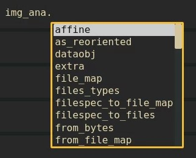
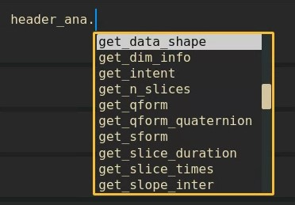

---

---

***Andres Eduardo Aracena Rangel***

*Estudiante del programa del Magister en Física Médica*

---

---

El siguiente Script de Python forma parte del trabajo especial de grado.

Profesora Guía:

*PhD María Daniela Cornejo*

---

---

Con referencia:

- [Pagina oficial Nibabel](https://nipy.org/nibabel/index.html)
- [Pagina oficial Numpy](https://numpy.org/)
- [Pagina oficial Pandas](https://pandas.pydata.org/ )

---

---

 # Atributos de neuroimagenes con *nibabel* y función 'atributos_img'

# Importamos librerias


```python
import time # medir el tiempo de ejecución de nuestros programas
start = time.process_time()
inicio = time.time()
```


```python
import os # El módulo os nos permite acceder a funcionalidades dependientes del Sistema Operativo
from os.path import join as opj # Este método concatena varios componentes de ruta con exactamente un separador de directorio(‘/’)

import numpy as np
import nibabel as nib # Acceso de letcura/escritura y visualización de algunos formatos comunes de neuroimagen
```

# Definimos Parametros 


```python
'''
Ruta del directorio de la data
'''
path_data = '/home/aracena/data/ds002422/'

'''
Ruta donde reposa la imagen anatomica
'''
path_anat = opj(path_data,'sub-01','anat')

'''
Ruta donde reposa la imagen funcional
'''
path_fmri = opj(path_data,'sub-01','func')

'''
Ruta donde reposa el archivo.json
'''
path_json = opj(path_data,'sub-01','func')
```

&nbsp;
# Cargamos imagenes anatomica y funcional

Para cargar imagenes en formato nii, importamos el modulo

    nibabel
    
> Este paquete proporciona acceso de lectura/escritura a algunos formatos de archivo médicos y de neuroimagen comunes, que incluyen: ANALYZE (simple, SPM99, SPM2 y posterior), GIFTI, NIfTI1, NIfTI2, CIFTI-2, MINC1, MINC2, AFNI BRIK / HEAD, MGH y ECAT, así como Philips PAR/REC. Podemos leer y escribir archivos de geometría, anotación y morfometría de FreeSurfer. Existe un soporte muy limitado para DICOM. NiBabel es el sucesor de PyNIfTI.

&nbsp;

[ref: nibabel](https://nipy.org/nibabel/)

&nbsp;


```python
# Anatomica
img_ana = nib.load(opj(path_anat,'sub-01_T1w.nii')) # Cargamos la imagen y creamos un objeto imagen_anatomica

# Fisiologica
img_fis = nib.load(opj(path_fmri, 'sub-01_task-rest_bold.nii.gz')) # Cargamos la imagen y creamos un objeto imagen_fisiologica
```

&nbsp;

Los objetos 
    
    img_ana    
    img_fis
    
son una instancia de una imagen nibabel

&nbsp;


```python
img_ana
```


    <nibabel.nifti1.Nifti1Image at 0x7fe324142d90>


```python
img_fis
```


    <nibabel.nifti1.Nifti1Image at 0x7fe324159100>


Un objeto de imagen nibabel tiene asociado o esta compuesta de tres cosas:
    
    - una matriz de N dimensiones que contiene los datos de la imagen,

    - una matriz afín (4, 4) mapeando las coordenadas de la matriz a las coordenadas en algún espacio de coordenadas mundial RAS+,
    
    - metadatos de imagen en forma de encabezado .

&nbsp;
# Atributos de las imagenes (objetos)
Como cualquier *objeto* de Python, se puede inspeccionar *img_ana* y/o *img_fis* para ver que atributos tiene.

Si trabajas en Jupiter Notebook, se recomienda habilitar la extension de Autocompletar texto (*Hiterland*), el cual, al escribir en el codigo el objeto seguido de un punto, nos mostrara los diferentes atributos de dicho objeto:



A continuacion se da el ejemplo de algunos atributos de las imagenes:

## Forma de la Matriz imagen


```python
print('---------------------------', '\n')

# Anatomica
form_ana = img_ana.shape # Atributo --> Forma Matriz
print('Forma de la matriz_ana:', '\n', form_ana, '------>', '3D', '\n')

print('---------------------------', '\n')

#Fisiologica
form_fis = img_fis.shape # Atributo --> Forma Matriz
print('Forma de la matriz_fis:', '\n', form_fis, '---->', '4D', '\n')

print('---------------------------', '\n')
```

    --------------------------- 
    
    Forma de la matriz_ana: 
     (256, 256, 176) ------> 3D 
    
    --------------------------- 
    
    Forma de la matriz_fis: 
     (64, 64, 36, 200) ----> 4D 
    
    --------------------------- 
    


Notemos como, la matriz de la imagen anatomica es de tres dimensiones (3D), mientras que la matriz de la imagen fisiologica es de cuatro dimensiones (4D)

&nbsp;
## Matriz afine
 El atributo
 
    affine

es la matriz afín que relaciona las coordenadas de la matriz de datos de imagen con las coordenadas en algunos sistemas de coordenadas mundiales RAS +.

&nbsp;


```python
np.set_printoptions(precision=2, suppress=True)
print('------------------------------------', '\n')
print('Matriz afín de la iamgen anatomica\n')
print(img_ana.affine)
print('\n------------------------------------', '\n')
```

    ------------------------------------ 
    
    Matriz afín de la iamgen anatomica
    
    [[   0.02   -0.01    1.    -91.24]
     [  -0.97   -0.07    0.02  129.15]
     [  -0.07    0.97    0.01 -153.46]
     [   0.      0.      0.      1.  ]]
    
    ------------------------------------ 
    


```python
print('------------------------------------', '\n')
print('Matriz afín de la iamgen fisiologica\n')
print(img_fis.affine)
print('\n------------------------------------', '\n')
```

    ------------------------------------ 
    
    Matriz afín de la iamgen fisiologica
    
    [[  -3.58   -0.28   -0.18  125.85]
     [  -0.27    3.57   -0.33 -114.61]
     [  -0.2     0.3     3.76  -56.3 ]
     [   0.      0.      0.      1.  ]]
    
    ------------------------------------ 
    


## Header de las imagenes

El header (encabezado) de una imagen contiene los metadatos de la imagen. La información en el encabezado diferirá entre los diferentes formatos de imagen. Por ejemplo, la información del encabezado de un archivo de formato NIfTI1 difiere de la información del encabezado de un archivo de formato MINC.

Nuestras imagenes en estudio estan en formato NIfTI1 y, por lo tanto, tiene un encabezado en formato NIfTI1:


```python
# Header imagen anatomica
header_ana = img_ana.header
print('Header de la imagen anatomica:', '\n','\n' , header_ana)
```

    Header de la imagen anatomica: 
     
     <class 'nibabel.nifti1.Nifti1Header'> object, endian='<'
    sizeof_hdr      : 348
    data_type       : b''
    db_name         : b''
    extents         : 0
    session_error   : 0
    regular         : b''
    dim_info        : 0
    dim             : [  3 256 256 176   1   1   1   1]
    intent_p1       : 0.0
    intent_p2       : 0.0
    intent_p3       : 0.0
    intent_code     : none
    datatype        : float32
    bitpix          : 32
    slice_start     : 0
    pixdim          : [-1.    0.98  0.98  1.    0.    1.    1.    1.  ]
    vox_offset      : 0.0
    scl_slope       : nan
    scl_inter       : nan
    slice_end       : 0
    slice_code      : unknown
    xyzt_units      : 10
    cal_max         : 0.0
    cal_min         : 0.0
    slice_duration  : 0.0
    toffset         : 0.0
    glmax           : 0
    glmin           : 0
    descrip         : b'FreeSurfer Nov 11 2008'
    aux_file        : b''
    qform_code      : scanner
    sform_code      : scanner
    quatern_b       : 0.5269799
    quatern_c       : -0.47705737
    quatern_d       : -0.50961006
    qoffset_x       : -91.23536
    qoffset_y       : 129.15376
    qoffset_z       : -153.45872
    srow_x          : [  0.02  -0.01   1.   -91.24]
    srow_y          : [ -0.97  -0.07   0.02 129.15]
    srow_z          : [  -0.07    0.97    0.01 -153.46]
    intent_name     : b''
    magic           : b'n+1'


```python
# Header imagen fisiologica
header_fis = img_fis.header
print('Header de la imagen fisiologica:', '\n','\n' , header_fis)
```

    Header de la imagen fisiologica: 
     
     <class 'nibabel.nifti1.Nifti1Header'> object, endian='<'
    sizeof_hdr      : 348
    data_type       : b''
    db_name         : b''
    extents         : 0
    session_error   : 0
    regular         : b'r'
    dim_info        : 0
    dim             : [  4  64  64  36 200   1   1   1]
    intent_p1       : 0.0
    intent_p2       : 0.0
    intent_p3       : 0.0
    intent_code     : none
    datatype        : int16
    bitpix          : 16
    slice_start     : 0
    pixdim          : [-1.    3.59  3.59  3.78  3.56  0.    0.    0.  ]
    vox_offset      : 0.0
    scl_slope       : nan
    scl_inter       : nan
    slice_end       : 0
    slice_code      : unknown
    xyzt_units      : 10
    cal_max         : 0.0
    cal_min         : 0.0
    slice_duration  : 0.0
    toffset         : 0.0
    glmax           : 0
    glmin           : 0
    descrip         : b'FSL5.0'
    aux_file        : b''
    qform_code      : aligned
    sform_code      : aligned
    quatern_b       : -0.038154073
    quatern_c       : 0.998028
    quatern_d       : 0.04250012
    qoffset_x       : 125.84934
    qoffset_y       : -114.60879
    qoffset_z       : -56.303707
    srow_x          : [ -3.58  -0.28  -0.18 125.85]
    srow_y          : [  -0.27    3.57   -0.33 -114.61]
    srow_z          : [ -0.2    0.3    3.76 -56.3 ]
    intent_name     : b''
    magic           : b'n+1'


&nbsp;
### Metodos del atributo *Header*



#### Forma de la matriz

    get_data_shape()
    
para obtener la forma de salida de la matriz de datos de imagen:

&nbsp;


```python
print(header_ana.get_data_shape())
```

    (256, 256, 176)


```python
print(header_fis.get_data_shape())
```

    (64, 64, 36, 200)


#### Tipo de datos numéricos

&nbsp;

    get_data_dtype()
    
para obtener el tipo de datos numérico en el que se almacenan los datos de la imagen:

&nbsp;


```python
print(header_ana.get_data_dtype(), '---> Tipo de datos de la imagen anatómica')
```

    float32 ---> Tipo de datos de la imagen anatómica


```python
print(header_fis.get_data_dtype(), '---> Tipo de datos de la imagen fisiológica')
```

    int16 ---> Tipo de datos de la imagen fisiológica


#### Tamaño de los vóxels

&nbsp;

    get_zooms() 
    
para obtener el tamaño de los vóxel en milímetros:

&nbsp;


```python
print(header_ana.get_zooms())
```

    (0.97656244, 0.9765625, 1.0)


```python
print(header_fis.get_zooms())
```

    (3.59375, 3.59375, 3.78, 3.56)


#### Tiempo entre exploraciones


```python
print(header_fis.get_zooms()[-1])
```

    3.56


&nbsp;

El último valor de

    header_fis.get_zooms()

en matrices de 4D, es el tiempo entre exploraciones en milisegundo; en este ejemplo, es de 2.4 *ms*

&nbsp;

Si deseamos guardar el tamaño del voxel

&nbsp;


```python
hea_vox_ana = header_ana.get_zooms()
tam_vox_ana = hea_vox_ana[0:3]

hea_vox_fis = header_fis.get_zooms()
tam_vox_fis = hea_vox_fis[0:3]

print('---------------------------------------------------\n')
print('El tamaño del voxel de la imagen anatomica es de:\n', tam_vox_ana,'mm')
print('\n---------------------------------------------------\n')
print('---------------------------------------------------\n')
print('El tamaño del voxel de la imagen fisiologica es de:\n', tam_vox_fis,'mm')
print('\n---------------------------------------------------\n')
```

    ---------------------------------------------------
    
    El tamaño del voxel de la imagen anatomica es de:
     (0.97656244, 0.9765625, 1.0) mm
    
    ---------------------------------------------------
    
    ---------------------------------------------------
    
    El tamaño del voxel de la imagen fisiologica es de:
     (3.59375, 3.59375, 3.78) mm
    
    ---------------------------------------------------
    


&nbsp;
# Cargar datos de la imagen

Para cualquier tipo de imagen (matriz o proxy), siempre puede obtener los datos con el método

    get_fdata()

Para la imagen de matriz, get_fdata() simplemente devuelve la matriz de datos


```python
# Anatomica
datos_img_ana = img_ana.get_fdata()

# Fisiologica
datos_img_fis = img_fis.get_fdata()
```

&nbsp;
## Numero de elemento de cada matriz

Para conocer el numero de elementos de la matriz imagen, no lo podremos realizar mediante los atributos de objetos de imagenes nifti. Para ello, se debe importar la libreria Numpy

    Numpy
    
> NumPy es el paquete fundamental para la computación científica en Python. Es una biblioteca de Python que proporciona un objeto de matriz multidimensional, varios objetos derivados (como matrices y matrices enmascaradas) y una variedad de rutinas para operaciones rápidas en matrices, incluida la manipulación matemática, lógica, de formas, clasificación, selección, I/O, transformadas discretas de Fourier, álgebra lineal básica, operaciones estadísticas básicas, simulación aleatoria y mucho más.

&nbsp;

[ref: numpy](https://numpy.org/)

&nbsp;


```python
import numpy as np
```


```python
# Anatómica
datos_ana_shape = datos_img_ana.shape # Atributo --> Forma Matriz

#Fisiológica
datos_fis_shape = datos_img_fis.shape # Atributo --> Forma Matriz

print('---------------------------', '\n')
print('Forma de la matriz_ana:', '\n', datos_ana_shape, '------>', '3D', '\n')
print('---------------------------', '\n')
print('Forma de la matriz_fis:', '\n', datos_fis_shape, '---->', '4D', '\n')
print('---------------------------', '\n')
```

    --------------------------- 
    
    Forma de la matriz_ana: 
     (256, 256, 176) ------> 3D 
    
    --------------------------- 
    
    Forma de la matriz_fis: 
     (64, 64, 36, 200) ----> 4D 
    
    --------------------------- 
    


```python
cant_ana = datos_img_ana.size # Atributo np --> Numero de elementos Matriz
cant_fis = datos_img_fis.size # Atributo np --> Numero de elementos Matriz

print('--------------------------------------\n')
print('Numero de elementos de la matriz_ana:\n', cant_ana, '\n')
print('\n--------------------------------------\n')
print('Numero de elementos de la matriz_fis:\n', cant_fis)
print('\n--------------------------------------\n')
```

    --------------------------------------
    
    Numero de elementos de la matriz_ana:
     11534336 
    
    
    --------------------------------------
    
    Numero de elementos de la matriz_fis:
     29491200
    
    --------------------------------------
    


# Orientación de la imagen


```python
# Anatómica
ori_ana = nib.orientations.aff2axcodes(img_ana.affine)

#Fisiológica
ori_fis = nib.orientations.aff2axcodes(img_fis.affine)

print('--------------------------------------\n')
print('Orientación de la imagen anatómica:\n', ori_ana)
print('\n--------------------------------------\n')
print('Orientación de la imagen fisiológica:\n', ori_fis)
print('\n--------------------------------------\n')
```

    --------------------------------------
    
    Orientación de la imagen anatómica:
     ('P', 'S', 'R')
    
    --------------------------------------
    
    Orientación de la imagen fisiológica:
     ('L', 'A', 'S')
    
    --------------------------------------
    


# Creación de la función 'atributos_img'

La siguiente función requiere como input un diccionario con la(s) imagen(es) que queremos extraer sus atributos en un DataFrame (DF) de pandas. Por lo tanto, debemos importar la librería Pandas:

    Pandas
> Librería escrita como extensión de NumPy para manipulación y análisis de datos para el lenguaje de programación Python. En particular, ofrece estructuras de datos y operaciones para manipular tablas numéricas y series temporales.

Pandas dispone de dos estructuras de datos fundamentales:

- Series: Estructura de una dimensión,
- DataFrame: Estructura de dos dimensiones (tablas), con indexación integrada. Cada columna contiene los valores de una variable y cada fila un conjunto de valores de cada columna.

El comportamiento fundamental sobre tipos de datos, indexación y etiquetado/alineación de ejes se aplica a todos los objetos. Estas estructuras se construyen a partir de arrays de la librería NumPy, añadiendo nuevas funcionalidades.

&nbsp;

[ref: Pandas](https://pandas.pydata.org/ )

&nbsp;


```python
'''
Función para extraer los atributos de la(s) imagen(es).

Inputs:

- img: Diccinario con las imagenes nifti

Output:

df_atri: Dataframe con los principales atributos de las imagenes contenidas en el diccionario 'img'
'''

def atributo_img(img):
    import pandas as pd
    lista_img = list(img.keys()) # Creamos una lista con las claves del diccionario

    df_atri = pd.DataFrame()
    df_atri.index = ['forma', 'dimension', 'orientacion', '', 'x_img', 'y_img' , 'z_img', 'volumenes_(N)', 'voxel_size_(mm)', 
                       'TR_(s)', 'tipo_dato', 'numero_voxels','min_img', 'max_img']
    
    for i, ima in enumerate(lista_img):
        lista_atri = []
        #cargamos el header de la imagen
        header_img = img[ima].header
        
        # Forma y dimensión de la imágen
        forma = header_img.get_data_shape() 
        lista_atri.append(str(forma))
        lista_atri.append(len(forma))
        
        # Orientacion de la imágen
        orientacion = nib.orientations.aff2axcodes(img[ima].affine)
        lista_atri.append(orientacion)

        # x, y, z y volumenes
        ejes=[]
        for i in range(len(orientacion)):
            tam = img[ima].shape[i]
            ori = str(orientacion[i])
            if  ori == 'L'or ori == 'R':
                x_img = tam
                a = 'x'

            elif ori == 'A' or ori == 'P':
                y_img = tam
                a = 'y'

            elif ori == 'I'or ori == 'S':
                z_img = tam
                a = 'z'
                
            ejes.append(a)
        
        # Agregamos a la lista de atributos forma, x, y, z
        lista_atri.append(ejes)
        lista_atri.append(x_img)
        lista_atri.append(y_img)
        lista_atri.append(z_img)
        
        # Agregamos volumes a la lista de atributos 
        if len(forma) == 4:
            lista_atri.append(forma[-1])
        else:
            lista_atri.append('1')

        # Tamaño del voxel
        tavo = header_img.get_zooms()[0:3]
        
        tamvox=[]
        for i in range(len(tavo)):
            tamvox.append(round(tavo[i],3))
            
        lista_atri.append(tamvox) 
        
        # Tiempo de exploración
        if len(header_img.get_zooms()) == 4:
            lista_atri.append(header_img.get_zooms()[-1])
        else:
            lista_atri.append('---')     
        
        
        #lista_atri.append(header_img.get_zooms()[-1])   # Tiempo de exploración
        lista_atri.append(header_img.get_data_dtype())   # Tipo de datos numérico
        lista_atri.append(img[ima].get_fdata().size) # Número de elementos de la matriz
        lista_atri.append(round(img[ima].get_fdata().min(),2)) # Valor minimo de la imágen
        lista_atri.append(round(img[ima].get_fdata().max(),2)) # Valor maximo de la imágen
        
        # Creamos DF de atributos de la imagen
        df_at = pd.DataFrame()
        df_at = pd.DataFrame(lista_atri)
        df_at.columns = [ima]
        df_at.index = df_atri.index
        #display(df_at)

        # Unimos las DF
        df_atri = pd.merge(df_atri, df_at,
                           right_index=True,left_index=True)
    return df_atri
```

## Ejecutamos función


```python
img_pru = {'anatomica_ds002422': img_ana, 'funcional_ds002422': img_fis}
```


```python
atributo_img(img=img_pru)
```


<div>
<style scoped>
    .dataframe tbody tr th:only-of-type {
        vertical-align: middle;
    }

    .dataframe tbody tr th {
        vertical-align: top;
    }

    .dataframe thead th {
        text-align: right;
    }
</style>
<table border="1" class="dataframe">
  <thead>
    <tr style="text-align: right;">
      <th></th>
      <th>anatomica_ds002422</th>
      <th>funcional_ds002422</th>
    </tr>
  </thead>
  <tbody>
    <tr>
      <th>forma</th>
      <td>(256, 256, 176)</td>
      <td>(64, 64, 36, 200)</td>
    </tr>
    <tr>
      <th>dimension</th>
      <td>3</td>
      <td>4</td>
    </tr>
    <tr>
      <th>orientacion</th>
      <td>(P, S, R)</td>
      <td>(L, A, S)</td>
    </tr>
    <tr>
      <th></th>
      <td>[y, z, x]</td>
      <td>[x, y, z]</td>
    </tr>
    <tr>
      <th>x_img</th>
      <td>176</td>
      <td>64</td>
    </tr>
    <tr>
      <th>y_img</th>
      <td>256</td>
      <td>64</td>
    </tr>
    <tr>
      <th>z_img</th>
      <td>256</td>
      <td>36</td>
    </tr>
    <tr>
      <th>volumenes_(N)</th>
      <td>1</td>
      <td>200</td>
    </tr>
    <tr>
      <th>voxel_size_(mm)</th>
      <td>[0.977, 0.977, 1.0]</td>
      <td>[3.594, 3.594, 3.78]</td>
    </tr>
    <tr>
      <th>TR_(s)</th>
      <td>---</td>
      <td>3.56</td>
    </tr>
    <tr>
      <th>tipo_dato</th>
      <td>float32</td>
      <td>int16</td>
    </tr>
    <tr>
      <th>numero_voxels</th>
      <td>11534336</td>
      <td>29491200</td>
    </tr>
    <tr>
      <th>min_img</th>
      <td>0.0</td>
      <td>0.0</td>
    </tr>
    <tr>
      <th>max_img</th>
      <td>3080.0</td>
      <td>1725.0</td>
    </tr>
  </tbody>
</table>
</div>


# Tiempo de ejecución


```python
fin = time.time()
end = time.process_time()
tiempo = fin - inicio
tiempo2 = end - start

print('--------------------------------------')
print('tiempo de ejecución\n\n', round(tiempo,3), 'seg\n', round(tiempo/60,3), 'min')     
print('--------------------------------------')
print('tiempo de ejecución del sistema y CPU\n\n', round(tiempo2,3), 'seg\n', round(tiempo2/60,3), 'min')
print('--------------------------------------')
```

    --------------------------------------
    tiempo de ejecución
    
     2.967 seg
     0.049 min
    --------------------------------------
    tiempo de ejecución del sistema y CPU
    
     1.615 seg
     0.027 min
    --------------------------------------


# Fin
